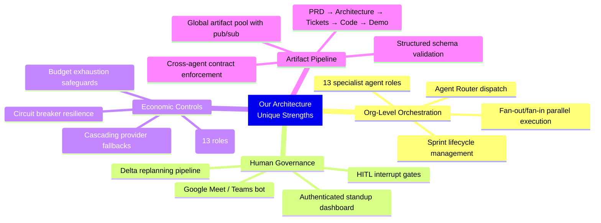
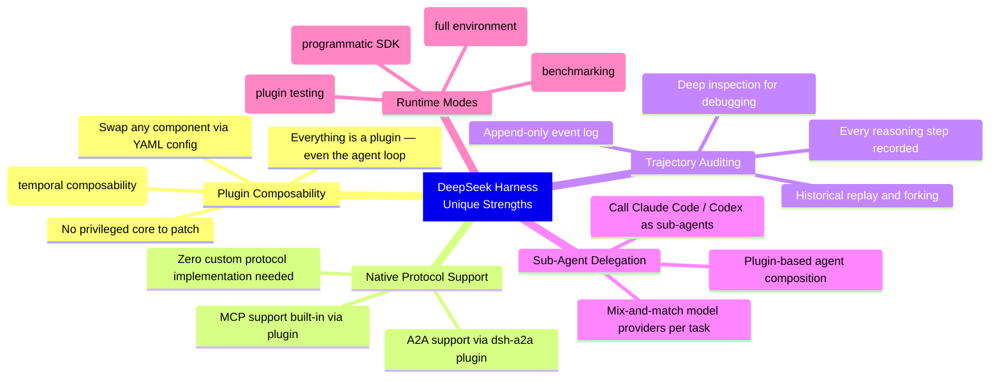

# Our Architecture vs DeepSeek Harness — Comparison & Integration Analysis

## TL;DR

Our architecture and DeepSeek Harness (DSH) operate at **different layers** and are **complementary, not competing**. Our system is a **macro-orchestration platform** (13 specialist agents, org-level sprint lifecycle, HITL standup system). DSH is a **micro-level agent runtime** (individual agent execution, plugin-based tool composition, session management). Integrating DSH replaces our custom agent execution layer with a battle-tested, plugin-extensible runtime — while LangGraph keeps the org-level coordination role.

---

## Architectural Comparison

| Dimension | Our Architecture (LangGraph + OpenHands) | DeepSeek Harness (dsh + Cordis) |
|-----------|------------------------------------------|----------------------------------|
| **Core abstraction** | Multi-agent organization with role hierarchy, sprint lifecycle, and artifact pools | Single-agent runtime with plugin-composed capabilities |
| **Architecture pattern** | Assembly-line pipeline with deterministic state machine (LangGraph StateGraph) | Micro-kernel: everything (model, tools, loop, sandbox, UI) is a swappable plugin |
| **Scope** | Org-level: 13 agents coordinating across product → architecture → engineering → QA → demo | Agent-level: one agent instance executing tasks with tools |
| **Multi-agent model** | Explicit role hierarchy with Agent Router, fan-out/fan-in, A2A task delegation | Plugin-based: other agents (Claude Code, Codex) can be wired as sub-agent plugins |
| **Orchestration** | LangGraph: checkpoint persistence, HITL interrupts, conditional edges, budget guards | Cordis: plugin lifecycle, spatial/temporal composability, declarative config |
| **State management** | PostgreSQL checkpoints for org-level state (PRD, tickets, kanban, sprint reports) | Append-only event log (Trajectory) for session-level execution trace |
| **Tool integration** | Custom MCP server implementations (filesystem, git, terminal, test_runner, browser) | Native MCP support via plugin — connect any MCP server with zero custom code |
| **Agent communication** | Custom A2A layer implementation | Native A2A plugin (`dsh-a2a`) — acts as both A2A server and client out of the box |
| **Sandbox execution** | Docker containers + optional SmolVM microVMs, managed by custom sandbox manager | Built-in sandbox plugin with multiple runtime modes (Standard, Code, Minimal) |
| **Configuration** | YAML provider registry for LLMs; Python code for agent logic | YAML/JSON for everything — agent loop, tools, models, sandbox, all declarative |
| **Model routing** | LiteLLM proxy with cascading fallbacks, circuit breakers, per-role budgets | Model-agnostic: model adapter is a plugin, swap via config |
| **Auditability** | Sprint reports, git logs, LangGraph event stream | Trajectory view: append-only log of every reasoning step, tool call, sub-agent dispatch |
| **Language** | Python 3.12+ (LangGraph, LiteLLM, Playwright all Python-native) | TypeScript (Cordis meta-framework) |
| **Human interaction** | Authenticated dashboard, Meet/Teams standup bot, HITL interrupts | Creator Mode for plugin inspection; no built-in executive governance |
| **License** | Composite (MIT, Apache-2.0 components) | MIT |

---

## Where Each System Excels

### What Our Architecture Has That DSH Doesn't



### What DSH Has That Our Architecture Doesn't



---

## Integration Proposal: DSH as Agent Execution Runtime

The key insight: **LangGraph stays as the macro-orchestrator, DSH replaces OpenHands SDK as the micro-runtime for each agent**.

### Before (Current Architecture)

```
LangGraph (org orchestration)
  └── Agent instances (custom Python + OpenHands SDK)
        └── Custom MCP server wiring
        └── Custom sandbox management
        └── Custom tool integration
```

### After (With DSH Integration)

```
LangGraph (org orchestration)
  └── DSH instances (one per specialist agent)
        └── Role-specific plugin profiles (YAML)
        └── Native MCP support (plugin)
        └── Native A2A support (dsh-a2a plugin)
        └── Built-in sandbox + trajectory logging
        └── Sub-agent delegation (call other agents as plugins)
```

### Integration Architecture

```mermaid
graph TB
    subgraph "Macro Layer (LangGraph - Python)"
        LG["LangGraph State Machine"]
        PG["PostgreSQL Checkpoints"]
        RD["Redis Circuit Breakers"]
        LITE["LiteLLM Gateway"]
        DASH["Dashboard + Auth"]
        MEET["Meet/Teams Bot"]
    end

    subgraph "Agent Router"
        AR["Domain-Tag Router"]
    end

    subgraph "DSH Runtime Instances"
        subgraph "Architect Pool"
            DSH_RA["DSH: Requirements Architect<br/>(profile: architect-requirements)"]
            DSH_SA["DSH: System Architect<br/>(profile: architect-system)"]
            DSH_DA["DSH: Data Architect<br/>(profile: architect-data)"]
            DSH_UXA["DSH: UX Architect<br/>(profile: architect-ux)"]
            DSH_SEC["DSH: Security Architect<br/>(profile: architect-security)"]
        end

        subgraph "Engineer Pool"
            DSH_BE["DSH: Backend Engineer<br/>(profile: engineer-backend)"]
            DSH_FE["DSH: Frontend Engineer<br/>(profile: engineer-frontend)"]
            DSH_UXE["DSH: UX Engineer<br/>(profile: engineer-ux)"]
        end

        subgraph "Verification"
            DSH_QA["DSH: QA Reviewer<br/>(profile: qa-reviewer)"]
            DSH_DEMO["DSH: Demo Agent<br/>(profile: demo-release)"]
        end
    end

    subgraph "Shared Infrastructure"
        MCP_FS["MCP: Filesystem"]
        MCP_GIT["MCP: Git"]
        MCP_TERM["MCP: Terminal"]
        MCP_TEST["MCP: Test Runner"]
        PW["Playwright"]
    end

    LG --> AR
    AR --> DSH_RA & DSH_SA & DSH_DA & DSH_UXA & DSH_SEC
    AR --> DSH_BE & DSH_FE & DSH_UXE
    AR --> DSH_QA & DSH_DEMO

    DSH_BE & DSH_FE & DSH_UXE -.->|"Native MCP plugin"| MCP_FS & MCP_GIT & MCP_TERM & MCP_TEST
    DSH_QA -.->|"Native MCP plugin"| MCP_FS & MCP_GIT & MCP_TEST
    DSH_DEMO -.->|"Native MCP plugin"| PW

    DSH_RA & DSH_SA & DSH_DA & DSH_UXA & DSH_SEC -.->|"dsh-a2a plugin"| DSH_BE & DSH_FE & DSH_UXE

    LG --> LITE
    DSH_RA & DSH_SA & DSH_DA & DSH_UXA & DSH_SEC --> LITE
    DSH_BE & DSH_FE & DSH_UXE --> LITE
    DSH_QA & DSH_DEMO --> LITE
```



### How It Works

#### 1. LangGraph dispatches to DSH instances

LangGraph remains the macro-orchestrator. When it needs to invoke a specialist agent, instead of calling a Python function with the OpenHands SDK, it spawns (or messages) a DSH instance configured with a role-specific profile:

```yaml
# profiles/engineer-backend.yml
plugins:
  - dsh-model-litellm:
      endpoint: "http://litellm-proxy:4000"
      model: "primary/reasoning"
      api_key: "${LITELLM_API_KEY}"
  - dsh-mcp:
      servers:
        - name: filesystem
          command: "mcp-server-filesystem"
          args: ["--root", "/workspace"]
        - name: git
          command: "mcp-server-git"
        - name: terminal
          command: "mcp-server-terminal"
        - name: test-runner
          command: "mcp-server-test-runner"
  - dsh-a2a:
      card:
        name: "backend-engineer"
        skills: ["implement-backend-ticket"]
      server: true
  - dsh-sandbox:
      mode: "standard"
      image: "agent-sandbox:backend"
  - dsh-trajectory:
      output: "/trajectories/backend-engineer/"
      format: "jsonl"
```

#### 2. DSH handles micro-level execution

Inside each DSH instance, Cordis manages the agent loop:
- The model plugin routes LLM calls through LiteLLM (our gateway handles fallbacks/budgets)
- The MCP plugin provides tool access — **no custom MCP server wiring code needed**
- The sandbox plugin manages isolated execution environments
- The trajectory plugin logs every step to an append-only JSONL file

#### 3. LangGraph collects results via A2A

DSH instances expose themselves as A2A agents via `dsh-a2a`. LangGraph's orchestrator queries task status and collects structured artifacts. This replaces our custom A2A layer implementation — **DSH gives us A2A compliance for free**.

#### 4. Trajectory logs feed the dashboard

DSH's trajectory JSONL files are ingested by the dashboard backend, providing deep visibility into each agent's reasoning process — something our current architecture would have to build from scratch.

---

## What Changes Per Phase

| Phase | Without DSH | With DSH Integration |
|-------|------------|---------------------|
| **P0 — Scaffolding** | Python monorepo, custom schemas | Add DSH as dependency (npm/npx), create profile YAML per role |
| **P1 — LangGraph** | Same | Same — LangGraph is unchanged, it's the macro layer |
| **P2 — Gateway** | Same | Same — LiteLLM is unchanged, DSH model plugin points to it |
| **P3 — Agent Infra** | Build custom `base.py`, sandbox manager, MCP servers from scratch | **Replaced**: DSH provides base runtime, sandbox, MCP integration via plugins. Write role-specific `cordis.yml` profiles instead of Python agent classes |
| **P3A — Specialist Agents** | Implement 13 Python agent classes with custom system prompts and tool bindings | **Simplified**: 13 DSH profile YAMLs + system prompt files. Agent logic is declarative config, not Python code |
| **P4 — Reference App** | Same | Same |
| **P5 — A2A Protocol** | Build custom A2A layer (agent cards, task manager, registry) from scratch | **Largely replaced**: `dsh-a2a` plugin handles agent cards, task lifecycle, and artifact exchange. We still need the LangGraph↔A2A bridge |
| **P6 — Demo Engine** | Same (Playwright pipeline) | Same — Playwright is a tool invoked by the Demo DSH instance via MCP |
| **P7 — Dashboard** | Same + build custom trajectory UI | **Enhanced**: Ingest DSH trajectory JSONL for deep agent-step visibility |
| **P8 — E2E** | Same | Same verification, but with DSH trajectory replay for debugging failures |

---

## What We Gain

| Benefit | Detail |
|---------|--------|
| **Eliminate custom MCP wiring** | DSH's MCP plugin connects to any MCP server declaratively — no Python MCP client code |
| **Eliminate custom A2A implementation** | `dsh-a2a` handles agent cards, task lifecycle, artifact exchange out of the box |
| **Eliminate custom sandbox manager** | DSH sandbox plugin manages execution environments with multiple modes |
| **Trajectory auditing for free** | Append-only execution logs with replay, forking, and deep inspection |
| **Plugin extensibility** | Community plugins for GitHub, databases, and other tools — extend agents via config |
| **Sub-agent composition** | DSH agents can call other agents (including Claude Code, Codex) as sub-agent plugins for specialized tasks |
| **Reduced Python agent code** | Agent behavior defined via YAML profiles + system prompts, not Python classes |
| **Faster specialist onboarding** | Adding a new specialist role = writing a new YAML profile, not a new Python module |

## What We Lose / Tradeoffs

| Tradeoff | Detail | Mitigation |
|----------|--------|------------|
| **Language split** | DSH is TypeScript; our orchestration layer is Python. Two runtimes in the stack | Clean separation: LangGraph (Python) manages org state, DSH (TS) manages agent execution. Communication via A2A (HTTP/SSE) |
| **DSH maturity** | Released Aug 13 2026 — 12 days old, developer preview (v0.1) | Start with OpenHands SDK for Phase 3, migrate to DSH in Phase 5 after it stabilizes. Or run both in parallel initially |
| **Cordis learning curve** | Plugin composition model (spatial/temporal composability) is novel | Profile YAMLs abstract most complexity. Only need deep Cordis knowledge for custom plugin development |
| **LiteLLM integration path** | DSH has its own model adapter plugin — need to wire it through our LiteLLM proxy rather than calling providers directly | Configure DSH model plugin to point at LiteLLM endpoint (OpenAI-compatible) |

---

## Recommended Integration Strategy

> [!IMPORTANT]
> Given DSH is 12 days old (v0.1 developer preview), I recommend a **phased adoption** rather than full commitment from day one.

### Option A: Phased Migration (Recommended)

1. **Phases 0–3**: Build with OpenHands SDK as originally planned. This is proven and stable.
2. **Phase 3A**: Implement specialist agents in Python as planned, but also create equivalent DSH profile YAMLs as a parallel experiment.
3. **Phase 5**: When implementing A2A, evaluate DSH `dsh-a2a` plugin vs our custom implementation. If DSH has stabilized (v0.2+), migrate agent execution to DSH instances. Keep LangGraph orchestration.
4. **Phase 8**: Full DSH runtime for all agents if the experiment succeeds.

### Option B: DSH-First (Higher Risk, Higher Reward)

1. **Phase 0**: Add DSH to the stack from day one.
2. **Phases 3–3A**: Skip custom Python agent classes entirely. Define all 13 agents as DSH profiles.
3. **Phase 5**: Use `dsh-a2a` natively instead of building custom A2A.
4. **Risk**: If DSH has breaking changes or missing features during its preview period, we're blocked.

### Option C: Hybrid (Balanced)

1. Use DSH for **engineer agents only** (Tier 4: Backend, Frontend, UX) where its tool-calling, sandbox, and MCP strengths matter most.
2. Keep **architect agents** (Tier 2) and **planning agents** (Tiers 1, 3) as Python classes — they're more about reasoning and structured output than tool execution.
3. Use DSH for **QA and Demo** agents where trajectory logging and tool automation are valuable.

> [!NOTE]
> All three options keep LangGraph as the macro-orchestrator and LiteLLM as the inference gateway. The choice is about what runs *inside* each agent node.

---

## Decision Needed

Which integration approach do you prefer?
- **Option A**: Safe — start with OpenHands, migrate to DSH later after it matures
- **Option B**: Aggressive — build on DSH from day one, accept the risk
- **Option C**: Hybrid — DSH for tool-heavy agents (engineers, QA, demo), Python for reasoning-heavy agents (PM, architects)
