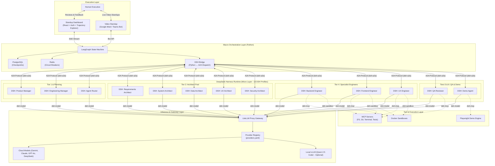
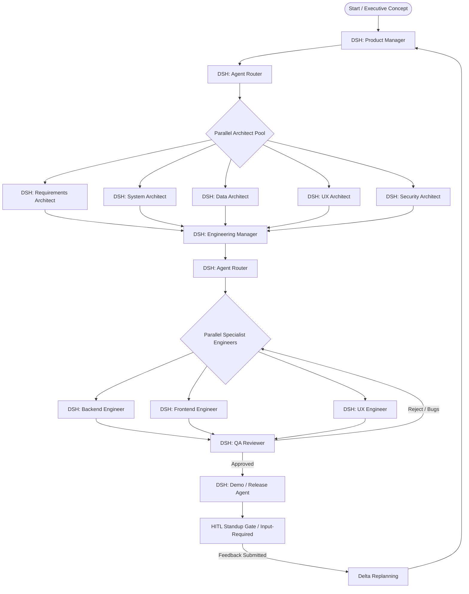
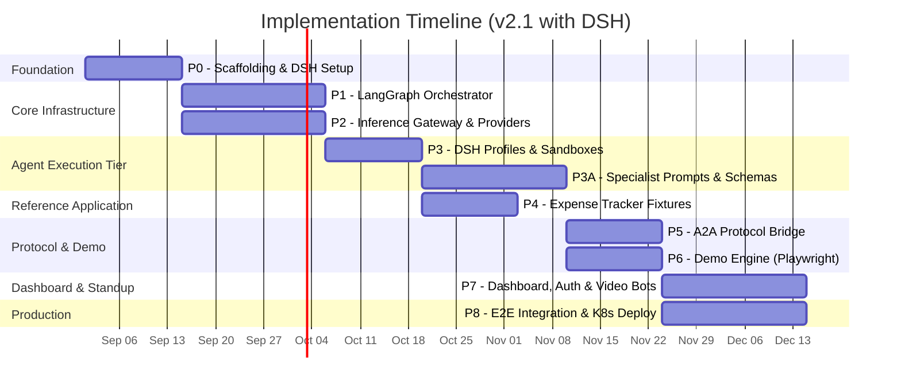

# Autonomous Multi-Agent Software Organization — Implementation Plan v2.1

A phased blueprint for building a production-grade, poly-model, multi-agent software engineering platform with **deep role specialization** (13 agent types), **DeepSeek Harness (`dsh`)** micro-kernel execution runtimes, standardized inter-agent protocols (A2A/MCP), token resilience, sandboxed execution, video standup integration, and an authenticated executive dashboard.

---

## Changes from v2

> [!IMPORTANT]
> **Major revisions in v2.1:**
> 1. **DeepSeek Harness (`dsh`) as Universal Agent Runtime** — Replaces OpenHands SDK and custom Python agent classes. All 13 agents run as modular DSH instances powered by the **Cordis** meta-framework.
> 2. **Declarative Plugin Profiles (`cordis.yml`)** — Specialist agents are defined through declarative YAML profiles and system prompts in `profiles/`, eliminating repetitive Python agent boilerplate.
> 3. **Native Protocol Support** — Leverages `dsh-mcp` for declarative tool connections and `dsh-a2a` for agent card discovery and task lifecycles out-of-the-box.
> 4. **Trajectory Auditing System** — Integrated DSH's append-only trajectory logs into the Standup Dashboard for complete step-by-step reasoning replay and debugging.
> 5. **Streamlined Engineering Phases** — Phase 3 (Sandbox/MCP) and Phase 5 (A2A) are significantly simplified by leveraging DSH's plugin ecosystem.

---

## Resolved Decisions

| Question | Decision |
|----------|----------|
| **Agent Execution Runtime** | **DeepSeek Harness (`dsh`)** with Cordis plugin profiles for all 13 agents |
| **Macro Orchestration** | **LangGraph** (Python) for organizational state, sprint lifecycle, and HITL gates |
| **Deployment Environment** | **Docker Compose** (dev) + **Kubernetes with Helm** (prod) — both |
| **GPU / Local Models** | Configurable: if local GPU configured (`enabled: true`), participate in fallback; otherwise cascade through cloud tiers |
| **Cloud LLM Providers** | All major providers (Gemini, Claude, GPT-4o, Groq, OpenRouter, DeepSeek) via scalable YAML registry |
| **Reference Application** | Personal Expense Tracking Web App with Bank Statement Scraping (PDF/CSV) |
| **Dashboard & Governance** | Production-hosted React app with OAuth2/OIDC (Google/GitHub SSO) + Trajectory Explorer |
| **Video Standups** | Bot-driven standups on **Google Meet** and **Microsoft Teams** (configurable) |
| **Sandboxing** | DSH sandbox plugin (Docker primary; SmolVM microVMs optional) |

---

## Architecture Overview



---

## Phase 0 — Project Scaffolding & Development Environment

**Duration**: 1–2 weeks  
**Goal**: Establish the monorepo, CI, dev tooling, DSH dependencies, and shared schema definitions.

### Proposed Changes

#### [NEW] Project root and monorepo structure

```
autonomous-org/
├── pyproject.toml                  # Root Python config (uv workspace)
├── package.json                    # Root Node config for DSH CLI & runtime
├── docker-compose.dev.yml          # Dev-mode compose (Postgres, Redis, LiteLLM)
├── Makefile
├── .env.example
│
├── profiles/                       # 13 DSH Cordis Declarative Profiles
│   ├── product-manager.cordis.yml
│   ├── engineering-manager.cordis.yml
│   ├── agent-router.cordis.yml
│   ├── architect-requirements.cordis.yml
│   ├── architect-system.cordis.yml
│   ├── architect-data.cordis.yml
│   ├── architect-ux.cordis.yml
│   ├── architect-security.cordis.yml
│   ├── engineer-backend.cordis.yml
│   ├── engineer-frontend.cordis.yml
│   ├── engineer-ux.cordis.yml
│   ├── qa-reviewer.cordis.yml
│   └── demo-release.cordis.yml
│
├── prompts/                        # System prompts mapped to DSH profiles
│   ├── product-manager.md
│   ├── architects/
│   ├── engineers/
│   └── ...
│
├── packages/
│   ├── core/                       # Shared Python types & DSH bridge
│   │   ├── schemas/                # Pydantic models for artifacts & state
│   │   ├── provider_registry.py    # Scalable LLM provider system
│   │   ├── dsh_bridge.py           # Python ↔ DSH A2A communication bridge
│   │   └── config.py
│   │
│   ├── orchestrator/               # LangGraph state machine (Phase 1)
│   ├── gateway/                    # LiteLLM proxy config & budget guards (Phase 2)
│   ├── mcp_servers/                # MCP server binaries (Phase 3)
│   ├── demo_engine/                # Playwright demo pipeline (Phase 6)
│   ├── dashboard/                  # React dashboard + auth + trajectory explorer (Phase 7)
│   └── standup_integrations/       # Google Meet / Teams bots (Phase 7)
│
├── infra/
│   ├── docker/                     # Dockerfiles for sandbox, DSH base, vLLM
│   ├── compose/                    # Compose profiles (dev, staging)
│   └── k8s/                        # Helm charts for production
│
└── tests/
    ├── unit/
    ├── integration/
    └── e2e/
```

#### [NEW] `packages/core/schemas/` — Global Artifact Pool Schemas

Pydantic models validating all structured inputs and outputs exchanged across A2A handoffs:
* `ProductRequirementsDocument`
* `RequirementsContract`
* `SystemArchitecture`
* `DataArchitecture`
* `UXSpecification`
* `SecuritySpecification`
* `TaskTicket` (with `domain_tags: list[str]`)
* `TaskDAG` & `KanbanState`
* `ArtifactBundle` & `SprintReport`
* `DeltaDocument`

#### [NEW] `packages/core/dsh_bridge.py` — Python ↔ DSH A2A Interface

Bridge layer allowing LangGraph nodes (Python) to interact with DSH agent instances (TypeScript/Cordis):
* Spawns or dispatches requests to DSH agent instances over HTTP/A2A JSON-RPC.
* Subscribes to SSE progress updates and streams them to orchestrator logs.
* Validates incoming DSH artifact payloads against Pydantic models in `core/schemas/`.

#### [NEW] `packages/core/provider_registry.py` — Scalable LLM Provider System

YAML-configured registry supporting zero-code provider additions and runtime toggles (`providers.yaml`).

---

## Phase 1 — LangGraph Orchestration Engine & Checkpoint Persistence

**Duration**: 2–3 weeks  
**Goal**: Build the macro state machine with parallel architect/engineer execution, checkpoint persistence, and HITL interrupt gates.

### Proposed Changes

#### [NEW] `packages/orchestrator/graph.py` — LangGraph Organizational Graph

LangGraph coordinates the high-level workflow. Rather than calling internal Python methods, each graph node dispatches a task via `dsh_bridge` to the designated DSH agent instance:



#### [NEW] `packages/orchestrator/checkpointer.py`

PostgreSQL checkpoint persistence using `langgraph-checkpoint-postgres`. Serializes thread state, active tickets, and references to DSH trajectory logs.

#### [NEW] `packages/orchestrator/circuit_breaker.py`

* Task iteration limits: escalates to Engineering Manager after 5 failed QA cycles.
* Trajectory diff hashing: detects cyclical code edits and halts infinite loops.

### Verification

- Unit tests for graph topology, fan-out/fan-in dispatching, and interrupt resumption.
- Integration test with mock DSH responses validating checkpoint serialization to PostgreSQL.

---

## Phase 2 — Inference Gateway & Token Resilience (LiteLLM + Scalable Providers)

**Duration**: 2–3 weeks  
**Goal**: Deploy the centralized LiteLLM proxy with dynamic provider configuration, cascading fallbacks, and 13-role budgeting.

### Proposed Changes

#### [NEW] `packages/gateway/litellm_config_generator.py`

Dynamically generates LiteLLM proxy configuration from `providers.yaml`.

**Fallback Cascade Flow**:
$$\text{Primary Cloud} \xrightarrow{429/\text{Fail}} \text{Secondary Cloud (Burst)} \xrightarrow{429/\text{Fail}} \text{Local vLLM (if enabled)} \xrightarrow{\text{Disabled}} \text{Tertiary Cloud}$$

#### [NEW] `packages/gateway/budgets.py` — Per-Role Token Quotas (13 Roles)

Per-role TPM, RPM, and monthly spend ceilings enforcing soft alerts (80%, 95%) and hard execution halts (100%).

#### [NEW] `packages/gateway/circuit_breaker.py`

Redis-backed three-state circuit breaker (CLOSED $\rightarrow$ OPEN $\rightarrow$ HALF-OPEN).

### Verification

- Hot-reloading test: add a provider to `providers.yaml` and verify dynamic routing update.
- Fallback test: simulate upstream 429 errors and confirm millisecond failover.
- Budget test: verify request rejection at 100% budget threshold.

---

## Phase 3 — DSH Agent Runtime & Sandbox Infrastructure

**Duration**: 2–3 weeks  
**Goal**: Configure the DeepSeek Harness runtime environment, declarative profile loader, Docker execution sandboxes, and MCP tool servers.

### Proposed Changes

#### [NEW] `profiles/*.cordis.yml` — Declarative Agent Profiles

Every agent is defined by a declarative Cordis configuration file.

*Example: Backend Engineer Profile (`profiles/engineer-backend.cordis.yml`)*
```yaml
name: "engineer-backend"
version: "1.0.0"

plugins:
  - name: "dsh-model-litellm"
    config:
      endpoint: "http://litellm-proxy:4000/v1"
      model: "primary/reasoning"
      api_key: "${LITELLM_MASTER_KEY}"
      temperature: 0.1

  - name: "dsh-mcp"
    config:
      servers:
        - name: "filesystem"
          transport: "stdio"
          command: "mcp-server-filesystem"
          args: ["--root", "/workspace"]
        - name: "git"
          transport: "stdio"
          command: "mcp-server-git"
        - name: "terminal"
          transport: "stdio"
          command: "mcp-server-terminal"
        - name: "test-runner"
          transport: "stdio"
          command: "mcp-server-test-runner"

  - name: "dsh-a2a"
    config:
      server: true
      port: 8081
      card:
        name: "backend-engineer"
        description: "Implements server-side APIs, database models, and parsing engines"
        skills:
          - id: "implement-backend-ticket"
            inputModes: ["application/json"]
            outputModes: ["application/json", "text/plain"]

  - name: "dsh-sandbox"
    config:
      mode: "standard"
      image: "agent-sandbox:backend"
      timeout_seconds: 1800

  - name: "dsh-trajectory"
    config:
      output_dir: "/trajectories/backend-engineer"
      format: "jsonl"
      record_tokens: true
```

*Example: UX Architect Profile (`profiles/architect-ux.cordis.yml`)*
```yaml
name: "architect-ux"
version: "1.0.0"

plugins:
  - name: "dsh-model-litellm"
    config:
      endpoint: "http://litellm-proxy:4000/v1"
      model: "primary/reasoning"
      api_key: "${LITELLM_MASTER_KEY}"
      temperature: 0.2

  - name: "dsh-a2a"
    config:
      server: true
      port: 8082
      card:
        name: "ux-architect"
        description: "Generates wireframe component trees and design token systems"
        skills:
          - id: "design-ux-spec"
            inputModes: ["application/json"]
            outputModes: ["application/json"]

  - name: "dsh-trajectory"
    config:
      output_dir: "/trajectories/ux-architect"
      format: "jsonl"
```

#### [NEW] `packages/mcp_servers/` — Standard MCP Tool Server Implementations

Standalone MCP server executables mounted into DSH via `dsh-mcp`:
* `filesystem`: File CRUD and fuzzy search.
* `git`: Commits, branch creation, diff generation.
* `terminal`: Sandboxed bash command execution.
* `test_runner`: Test execution and code coverage calculation.
* `browser`: Headless Chromium manipulation for the Demo Agent.

### Verification

- DSH profile verification: validate all 13 `cordis.yml` profiles load cleanly into DSH.
- MCP connectivity test: verify `dsh-mcp` connects to each server and executes tools.
- Sandbox test: confirm commands execute inside ephemeral Docker containers without host contamination.

---

## Phase 3A — Specialist Agent Profiles & System Prompts

**Duration**: 3 weeks  
**Goal**: Author comprehensive domain system prompts and testable output schemas for all 13 specialist roles.

### Proposed Changes

#### System Prompts & Output Schema Mapping in `prompts/`

| Agent Role | Profile YAML | System Prompt File | Primary Deliverable |
|------------|--------------|-------------------|---------------------|
| **Product Manager** | `product-manager.cordis.yml` | `prompts/pm.md` | `ProductRequirementsDocument` |
| **Requirements Architect** | `architect-requirements.cordis.yml` | `prompts/architect-req.md` | `RequirementsContract` |
| **System Architect** | `architect-system.cordis.yml` | `prompts/architect-sys.md` | `SystemArchitecture` & OpenAPI 3.1 |
| **Data Architect** | `architect-data.cordis.yml` | `prompts/architect-data.md` | `DataArchitecture` & SQL Migrations |
| **UX Architect** | `architect-ux.cordis.yml` | `prompts/architect-ux.md` | `UXSpecification` & JSON Wireframes |
| **Security Architect** | `architect-security.cordis.yml` | `prompts/architect-sec.md` | `SecuritySpecification` & STRIDE |
| **Agent Router** | `agent-router.cordis.yml` | `prompts/router.md` | Routing Decisions (`domain_tags`) |
| **Engineering Manager** | `engineering-manager.cordis.yml` | `prompts/em.md` | `TaskDAG` & `KanbanState` |
| **Backend Engineer** | `engineer-backend.cordis.yml` | `prompts/eng-backend.md` | Server Code, Unit Tests, Migrations |
| **Frontend Engineer** | `engineer-frontend.cordis.yml` | `prompts/eng-frontend.md` | React Code, CSS, Component Tests |
| **UX Engineer** | `engineer-ux.cordis.yml` | `prompts/eng-ux.md` | Design System Code, a11y Tests |
| **QA / Reviewer** | `qa-reviewer.cordis.yml` | `prompts/qa.md` | Test Logs, Coverage, Review Verdict |
| **Demo / Release** | `demo-release.cordis.yml` | `prompts/demo.md` | Demo MP4 Videos, Playwright Traces |

### Verification

- Schema adherence testing: feed mock inputs to each DSH instance and assert generated outputs strictly validate against Pydantic models in `packages/core/schemas/`.
- Prompt regression suite: test edge-case prompts against each architect profile.

---

## Phase 4 — Reference Application: Bank Statement Expense Tracker

**Duration**: 2 weeks (parallel with Phase 3A)  
**Goal**: Prepare the reference test suite and synthetic fixtures for the Expense Tracking application.

### Proposed Changes

#### [NEW] `tests/e2e/expense_tracker_fixtures/`

* Synthetic bank statements in multi-page PDF and multi-column CSV formats.
* Reference parsing dictionaries and expected transaction category mappings.
* Seed database fixtures for instant local testing.

---

## Phase 5 — A2A Protocol Layer & Inter-Agent Discovery

**Duration**: 1–2 weeks  
**Goal**: Connect the `dsh-a2a` plugin network with LangGraph's dispatch bridge.

### Proposed Changes

#### [NEW] `packages/core/a2a_registry.py`

* Aggregates Agent Cards exposed by running DSH instances at `http://<agent-host>:<port>/.well-known/agent.json`.
* Provides discovery lookups by skill (`implement-backend-ticket`, `design-ux-spec`) for the Agent Router.

#### [MODIFY] `packages/core/dsh_bridge.py`

* Manages A2A task lifecycles (`submitted` $\rightarrow$ `working` $\rightarrow$ `completed` / `failed`).
* Streams multi-part artifact bundles from DSH instances into the central LangGraph state store.

### Verification

- A2A protocol test: dispatch task from LangGraph $\rightarrow$ DSH Backend Engineer $\rightarrow$ collect artifact.
- Registry discovery test: resolve agent endpoint by skill query.

---

## Phase 6 — Automated Demo Synthesis Engine (Playwright)

**Duration**: 2 weeks  
**Goal**: Build the automated UI journey recorder driven by the DSH Demo Agent.

### Proposed Changes

#### [NEW] `packages/demo_engine/`

* `environment.py`: Ephemeral boot and teardown of application stack (frontend: 3000, backend: 8000, DB).
* `recorder.py`: Sandboxed Chromium execution with visible cursor overlays, click ripple animations, and slow-motion pacing (`slow_mo=500`).
* `bundler.py`: Packages MP4 video walkthroughs, Playwright trace archives, and step-by-step screenshots into an `ArtifactBundle`.

### Verification

- End-to-end recording test: execute sample user journey and assert valid, playable MP4 video output.

---

## Phase 7 — Executive Standup Dashboard & Video Integrations

**Duration**: 3 weeks  
**Goal**: Deploy the authenticated web dashboard with DSH Trajectory Explorer and Google Meet / Teams standup bots.

### Proposed Changes

#### [NEW] `packages/dashboard/` — Authenticated React Application

* **Sprint Overview & Virtual Kanban**: Live board showing task movements via SSE.
* **Demo Theater**: Embedded MP4 video player with chapter markers mapped to PRD user stories.
* **Agent Trajectory Explorer**: Real-time inspection and historical step-by-step replay of DSH execution logs (`.jsonl`).
* **Live Sandbox Web View**: Embedded iframe to interact directly with the running container.
* **Token & Spend Monitor**: Live gauges displaying budget consumption per role.
* **Feedback Input Console**: Form for submitting executive steering directives.
* **OAuth2 / OIDC Auth**: Google and GitHub SSO with RBAC (`executive`, `viewer`, `admin`).

#### [NEW] `packages/standup_integrations/` — Video Standup Bots

* **Google Meet Bot**: Schedules meetings via Calendar API, joins call, screen-shares demo MP4s, posts sprint metrics in chat, and transcribes spoken executive feedback.
* **Microsoft Teams Bot**: Creates meetings via MS Graph API, joins meeting, sends Adaptive Cards, and logs meeting feedback.

### Verification

- OAuth authentication flow verification with Google and GitHub test accounts.
- Standup bot call-joining and video screen-sharing test.
- Trajectory Explorer test: load and replay multi-step DSH session logs.

---

## Phase 8 — End-to-End Integration, Hardening & Production Deployment

**Duration**: 3 weeks  
**Goal**: Execute the complete autonomous build of the Expense Tracker, verify guardrails, and deploy to Kubernetes.

### Proposed Changes

#### [NEW] `tests/e2e/test_full_cycle.py` — Autonomous Build Cycle Test

Executes the full pipeline without human intervention until the standup gate:
1. Product Vision ingested by DSH Product Manager $\rightarrow$ PRD generated.
2. DSH Agent Router activates 5 Specialist Architects in parallel.
3. Outputs combined into formal contracts, OpenAPI specs, DB migrations, JSON wireframes, and threat models.
4. DSH Engineering Manager compiles WBS and dispatches domain-tagged tickets.
5. DSH Backend, Frontend, and UX Engineers implement application code within Docker sandboxes.
6. DSH QA Reviewer executes static analysis and integration suites.
7. DSH Demo Agent records MP4 user journeys with cursor overlays.
8. Standup Gate triggers: Executive reviews demo via dashboard or Meet/Teams bot.
9. Executive submits steering feedback $\rightarrow$ Delta replanning cycle executes seamlessly.

#### [NEW] `infra/k8s/` — Production Kubernetes Helm Charts

* StatefulSets for PostgreSQL and Redis with PersistentVolumeClaims.
* Deployments with Horizontal Pod Autoscaling (HPA) for DSH agent pods.
* Ingress controller with automated TLS termination for the dashboard.
* Optional GPU node affinity for local vLLM instances.

### Verification

- Full E2E autonomous test execution under 2 hours.
- Chaos testing: inject provider outages and verify seamless fallbacks.
- Trajectory verification: assert 100% auditability across all agent reasoning steps.
- Helm dry-run and staging cluster deployment validation.

---

## Summary: Phase Timeline (v2.1)



> [!NOTE]
> Leveraging DSH reduces implementation time in Phases 3, 5, and 8. The critical path is **~18–20 weeks** with parallel tracks.

---

## Key Technology Decisions

| Dimension | Selected Technology | Rationale |
|-----------|--------------------|-----------|
| **Macro Orchestrator** | **LangGraph** (Python) | Deterministic state machine, PostgreSQL checkpoints, HITL gates |
| **Agent Execution Runtime** | **DeepSeek Harness (`dsh`)** (TypeScript/Cordis) | Micro-kernel, everything-is-a-plugin, native MCP/A2A, trajectory logging |
| **Inference Gateway** | **LiteLLM Proxy** | Unified provider routing, cascading 429 fallbacks, Redis circuit breakers |
| **Tool Protocol** | **Model Context Protocol (MCP)** via `dsh-mcp` | Universal open standard for filesystem, bash, git, and testing tools |
| **Inter-Agent Protocol** | **Agent-to-Agent (A2A)** via `dsh-a2a` | Standardized agent discovery, task states, and multi-part artifact exchange |
| **Executive Dashboard** | **React + Vite + TypeScript** | Real-time SSE streaming, rich video playback, DSH trajectory explorer |
| **Authentication** | **OAuth2 / OIDC** (Google, GitHub SSO) | Production-grade security and role-based access control |
| **Video Standups** | **Google Meet API & Teams Bot SDK** | Bot-driven interactive standup meetings with demo screen-sharing |
| **Dev Orchestration** | **Docker Compose** | Simple, reproducible local environment |
| **Prod Orchestration** | **Kubernetes (Helm Charts)** | HPA autoscaling, high availability, rolling updates |

---

## Verification Plan

### Automated Testing Suite
```bash
# 1. Run Python unit tests (schemas, router, dsh_bridge, gateway)
uv run pytest tests/unit/ -v

# 2. Validate all 13 DSH Cordis YAML profiles
npm run test:dsh-profiles

# 3. Integration tests with dev containers (PostgreSQL, Redis, LiteLLM)
docker compose -f docker-compose.dev.yml up -d
uv run pytest tests/integration/ -v

# 4. Full autonomous cycle test (Expense Tracker build)
uv run pytest tests/e2e/test_full_cycle.py -v --timeout=7200

# 5. Helm chart verification
helm lint ./infra/k8s && helm template ./infra/k8s -f ./infra/k8s/values.prod.yaml
```

### Manual & Governance Verification
- **Trajectory Audit**: Inspect DSH `.jsonl` logs in the Dashboard Trajectory Explorer to verify agent reasoning steps.
- **Standup Walkthrough**: Join a simulated Google Meet / Teams standup session, review bot screen-share of the demo video, and submit feedback.
- **Failover & Budget Simulation**: Trip circuit breaker to verify fallback to secondary/local tiers; verify graph halts when token budgets hit 100%.
